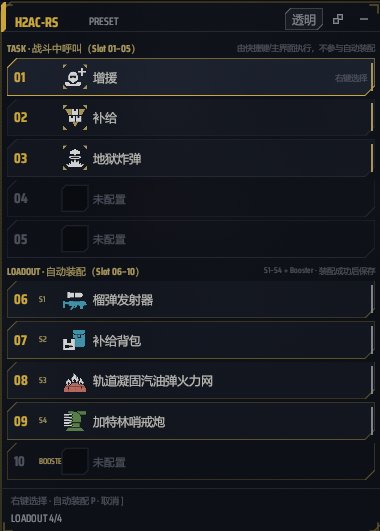

# H2AC-RS

**Helldivers 2 Auto Stratagem Caller — Rust Rewrite**

Windows 桌面端的《HELLDIVERS 2》战备管理与自动调用工具。H2AC-RS 提供战备库、插件、Profile、全局快捷键和紧凑配装预设；在游戏内配装界面时，还可以通过截图识别和鼠标操作自动完成四个战备与一个可选强化的装配。

> 本项目只模拟正常的键盘和鼠标输入，不修改游戏文件、内存，不注入 DLL，也不修改游戏快捷键。

## 界面预览

### 主界面

主界面用于管理战备库、配置 10 个槽位、编辑插件、执行战备和管理 Profile。

.png>)

### 紧凑配装预设

紧凑模式用于在游戏配装过程中快速查看和编辑下排 Loadout 预设。它可以置顶、调节透明度，并支持点击穿透。



## 功能

### 战备调用

- 10 个槽位：Slot 01~05 用于普通战斗中的战备调用，Slot 06~10 用于游戏内 Loadout 预设。
- 双击槽位或使用槽位快捷键，向游戏发送对应的方向键序列。
- 支持激活键、按键间隔和预延迟配置。
- 支持 WASD、ESDF 或方向键映射。
- 执行时显示状态和金色闪光提示。
- 可通过顶栏或全局热键启用/停用热键监听。

### 战备库与插件

- 内置战备库，按 Orbital、Eagle、Support、Backpacks、Vehicles、Sentries、Emplacements、Mission 等分类组织。
- 支持名称和型号搜索。
- 支持通过右键菜单装入、编辑分类、编辑数据和删除可编辑条目。
- 在 `plugins/` 中放入 JSON 文件即可添加自定义战备。
- 内置插件创建器，可录制方向键序列并生成插件数据。
- 支持从 `helldivers.wiki.gg` 在线更新战备和强化数据；联网获取的数据会写入 `plugins/_wiki.json` 与 `plugins/_boosters.json`。
- 强化（Booster）作为独立分类管理。强化用于 Loadout 预设，不具备普通战备的呼叫指令。

### Profile

- 保存、加载和删除多套配装方案。
- Profile 保存槽位分配、插件战备和热键绑定。
- Profile 位于程序目录下的 `profiles/`。

### 自动装配（Loadout Sync）

自动装配使用参考项目的视觉识别、窗口捕获、列表导航和输入流程完成游戏内配装。H2AC-RS 负责把自己的 Slot 06~10 翻译成游戏侧目标，并报告进度和错误。

| H2AC-RS 槽位 | 游戏侧目标 |
| --- | --- |
| Slot 06 | Stratagem 1 |
| Slot 07 | Stratagem 2 |
| Slot 08 | Stratagem 3 |
| Slot 09 | Stratagem 4 |
| Slot 10 | Booster，可留空 |

执行流程包括：

1. 检查四个战备是否已配置，以及目标是否能映射到参考图标目录。
2. 捕获游戏窗口并识别当前是否处于 Loadout Home。
3. 识别战备列表、分页和滚动位置。
4. 依次选择四个战备，并在配置了 Slot 10 时选择 Booster。
5. 通过悬停、点击和截图确认选择结果。
6. 成功后才将紧凑模式草稿写回 Slot 06~10；失败或取消不会覆盖原预设。

自动装配的使用前提：

- Windows 10 1903 或更高版本。
- `HELLDIVERS 2` 处于前台，并停留在游戏内 Loadout 配装界面。
- H2AC-RS 与游戏的权限级别相同；如果系统拒绝输入，可尝试以管理员身份运行两者。
- Slot 06~09 必须配置四个不同的战备。Slot 10 可以为空。
- 战备或强化必须存在于当前参考图标目录中；任务专属、无法识别或没有图标映射的条目不会被强行选择。

自动装配不依赖固定的游戏快捷键，也不通过修改游戏文件实现。截图优先使用 Windows Graphics Capture（WGC），必要时回退到 GDI 桌面捕获。捕获、识别、滚动、输入和验证失败时会停止流程并在日志中报告原因。

## 快捷键

默认快捷键如下，均可在设置面板中修改：

| 功能 | 默认快捷键 | 说明 |
| --- | --- | --- |
| 自动装配 | `F7` | 在普通模式、紧凑模式或浮窗隐藏时都可触发；只负责启动装配 |
| 显示/隐藏紧凑浮窗 | `Ctrl+Shift+F7` | 只改变浮窗可见性，不启动自动装配 |
| 取消自动装配 | `Ctrl+Shift+F9` | 停止后续步骤并释放输入 |
| 启用/停用监听 | 可选 | 快速切换全局战备热键监听 |
| 槽位热键 | 可配置 | 支持字母、数字、F1~F24 及常用标点 |

三个自动化相关快捷键职责相互独立：

- `Ctrl+Shift+F7` 只控制浮窗。
- `F7` 只控制自动装配。
- `Ctrl+Shift+F9` 只负责取消。

## 使用说明

### 普通模式

1. 启动 H2AC-RS。
2. 点击一个槽位，使其进入待命状态。
3. 从战备库点击条目，将战备装入槽位。
4. 双击已配置槽位，或使用该槽位的快捷键调用战备。
5. 使用右键菜单编辑分类、设置热键或清除槽位。

### 紧凑模式

1. 按 `Ctrl+Shift+F7` 打开配装预设浮窗。
2. 使用右键菜单编辑下排 Slot 06~10。
3. Slot 06~09 配置四个游戏内战备；Slot 10 可选择一个 Booster。
4. 在游戏 Loadout Home 中按 `F7`。
5. 自动装配期间可以再次打开浮窗查看进度，但不能编辑预设。
6. 按 `Ctrl+Shift+F9` 可随时取消。

自动装配结束后，浮窗会恢复到开始前的可见状态；如果用户在运行期间主动改变了浮窗状态，则以用户操作为准。

## 安装与运行

### 便携版

解压发布包后运行 `h2ac-rs.exe`。程序会在 exe 所在目录读取和写入：

```text
config.json
plugins/
profiles/
assets/icons/
```

### 从源码构建

要求：

- Windows 10/11 64 位
- Rust stable
- 可访问 crates.io 的网络环境（首次构建需要下载依赖）

```powershell
git clone https://github.com/Kevinnnooobb/Helldivers-2-AutoCommand_Rust.git
cd Helldivers-2-AutoCommand_Rust
cargo build --release
```

生成文件：

```text
target/release/h2ac-rs.exe
```

如需生成安装程序，可使用 Inno Setup 编译仓库中的 `installer.iss`。

## 插件格式

插件文件放在 `plugins/` 目录，启动时自动加载。示例：

```json
{
  "id": "my_plugin",
  "name": "自定义插件",
  "enabled": true,
  "stratagems": [
    {
      "name": "自定义战备",
      "category": "Support Weapons",
      "model": "CUSTOM",
      "command": ["up", "down", "left", "right"],
      "description": "自定义战备描述",
      "icon": "custom_icon"
    }
  ]
}
```

插件图标可以放在 exe 旁的 `assets/icons/` 目录中。图标文件名应与 JSON 中的 `icon` 值对应，例如：

```text
assets/icons/custom_icon.png
```

也可以直接使用主界面中的插件创建器，避免手动编辑 JSON。

## 配置与数据目录

程序运行目录下的主要文件和目录：

| 路径 | 用途 |
| --- | --- |
| `config.json` | 当前槽位、按键、监听状态、窗口和自动装配设置 |
| `plugins/` | 用户插件及在线获取的战备/强化数据 |
| `profiles/` | Profile 配置 |
| `assets/icons/` | 运行时发现的 PNG 图标 |
| `logs/` 或日志文件 | 运行和自动装配诊断信息，具体位置以当前版本日志提示为准 |

配置文件缺少字段时会使用默认值。建议通过设置面板修改配置，不要在自动装配运行期间手动编辑 `config.json`。

## 项目结构

```text
h2ac-rs/
├── Cargo.toml
├── build.rs
├── installer.iss
├── assets/
│   ├── fonts/
│   ├── icons/
│   ├── reference/
│   ├── main (1).png
│   └── mini.png
├── src/
│   ├── main.rs
│   ├── config.rs
│   ├── executor.rs
│   ├── hotkey.rs
│   ├── plugin.rs
│   ├── stratagems.rs
│   ├── wiki_fetcher.rs
│   ├── compact_mode/
│   ├── loadout/
│   ├── loadout_sync/
│   ├── model/
│   ├── ui/
│   ├── capture/
│   ├── input/
│   ├── vision/
│   └── window/
├── plugins/
└── profiles/
```

自动装配的动作流程位于 `src/loadout/`，H2AC 与参考目录、配置和进度之间的适配位于 `src/loadout_sync/`。

## 开发命令

```powershell
cargo check
cargo test
cargo build --release
```

自动装配的视觉诊断测试可能需要 Windows 桌面、游戏窗口或本地截图夹具；在没有相应环境时，应按测试输出单独运行相关诊断，而不是把它们当作普通单元测试结果解读。

## 故障排查

### 战备调用没有反应

- 检查监听开关是否已启用。
- 确认 H2AC-RS 与游戏使用相同权限级别。
- 检查方向键映射和激活键是否与游戏设置一致。
- 适当增加按键间隔和预延迟。
- 查看应用日志，确认热键是否被识别以及指令是否已发送。

### 自动装配没有启动

- 确认四个战备已配置在 Slot 06~09。
- 确认游戏窗口标题和前台状态正确。
- 确认游戏停留在 Loadout Home，而不是战备列表或其他页面。
- 如果某个目标不在参考图标目录中，先更换为支持的战备或补充正确的图标资源。

### 自动装配找不到战备或 Booster

- 确认游戏分辨率、窗口模式和显示缩放没有在运行期间变化。
- 保持游戏窗口完整可见，避免其他窗口遮挡或覆盖。
- 查看日志中的目标映射、捕获后端和识别阶段错误。
- Booster 是可选目标；如果不需要自动选择 Booster，可以清空 Slot 10。

### 插件图标不显示

- 检查 `assets/icons/{icon}.png` 是否存在。
- 确认 JSON 中的 `icon` 值不包含扩展名。
- 重启程序，使插件和运行时图标重新加载。

## 致谢

- 自动装配流程参考 [xmg228/hd2-preset-helper](https://github.com/xmg228/hd2-preset-helper) 项目；本地实现来源为其 clone 的 `hd2-preset-helper-0.1.4` 目录，复用了视觉识别、窗口捕获、列表导航和输入流程。本仓库仅保留与 H2AC-RS 集成所需的适配层；参考项目的许可和版权声明以其原始仓库为准。
- 战备数据：[helldivers.wiki.gg/wiki/Stratagems](https://helldivers.wiki.gg/wiki/Stratagems)
- 强化数据：[helldivers.wiki.gg/wiki/Boosters](https://helldivers.wiki.gg/wiki/Boosters)
- 战备图标：[nvigneux/Helldivers-2-Stratagems-icons-svg](https://github.com/nvigneux/Helldivers-2-Stratagems-icons-svg)
- 字体：[Saira Condensed](https://fonts.google.com/specimen/Saira+Condensed)，遵循其原始字体许可。

第三方数据、图标、字体和参考项目仍归各自权利人所有，并不因本项目采用 GPL 而自动转换许可。使用或再分发这些内容时，请同时遵守对应来源的许可和使用条款。

`HELLDIVERS 2`、Super Earth 及相关游戏名称、标识和素材是 Arrowhead Game Studios AB 及其相关权利人的商标或内容。本项目为非官方社区工具，与 Arrowhead Game Studios AB、Sony Interactive Entertainment 或相关发行方没有隶属、授权或背书关系。

## 许可

本项目源代码根据 **GNU General Public License v3.0 或更高版本**（GPL-3.0-or-later）发布。完整许可文本见仓库根目录的 [LICENSE](LICENSE) 文件。

除非适用法律另有规定，软件按“现状”提供，不提供任何明示或默示担保。重新分发或修改本项目时，请保留版权和许可声明，并按照 GPL-3.0-or-later 的要求提供相应源代码。
